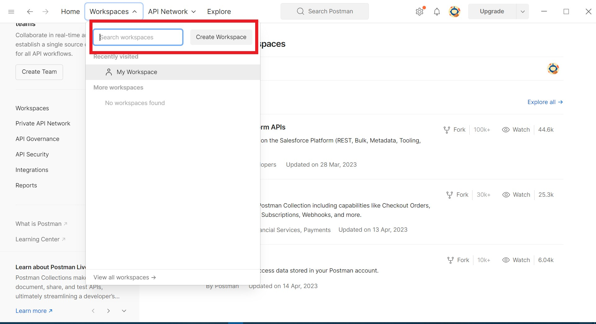
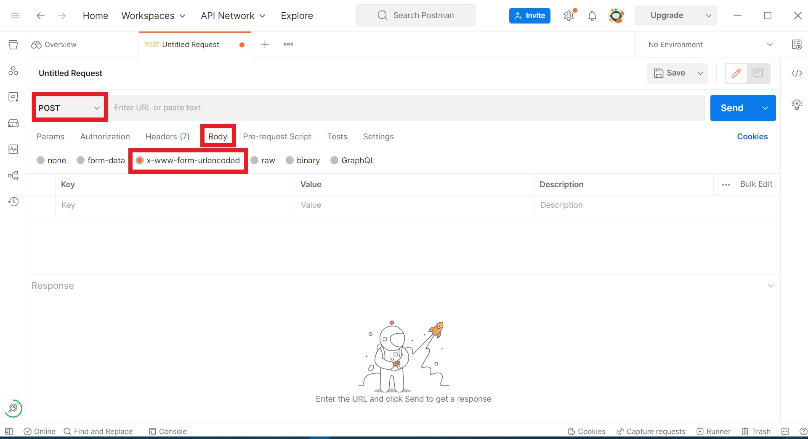
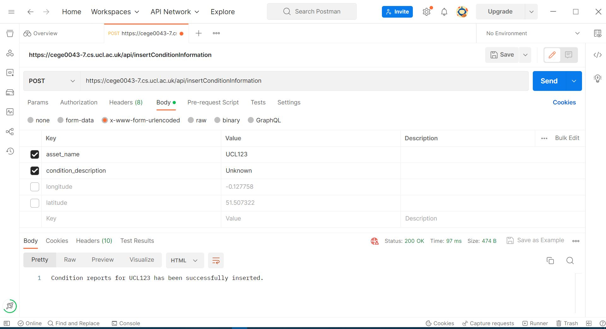
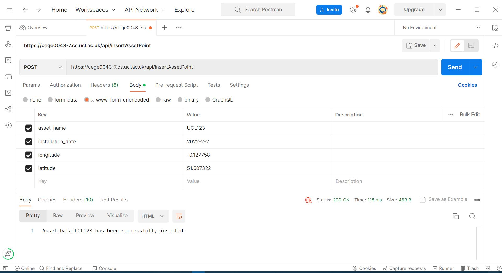

# cege0043-api-22-23-sgcjin
This data API is a NodeJS RESTful Data API that saves the assets and conditions to a PostgreSQL database and serves the information about the assets. By using this API, users can do the following:

* Insert a new asset with its location and installation date.

* Generate lists of assets with locations and details.

* Store condition reports of the assets.

# System Requirements
* In order to run this API, a Linux (Rocky 9) server is required. We suggest that you use Cyberduck software to use SSH to connect to the server.

* If you are going to use this API outside the UCL campus (not connected to Eduroam), make
sure you are connected to UCL VPN by following the instructions
at https://www.ucl.ac.uk/isd/services/get-connected/remote-working-services/ucl-virtualprivate-network-vpn.

* In order to test the endpoints for POST in this API, [Postman](https://www.postman.com/) is required to be installed.

# Procedures to deploy this API:
1. Connect to your server via SSH and open the command line (terminal) window for the server.

2. Start the Apache server by typing in the command line (terminal) window:
```
service httpd start
```

2. Clone the source code of this API from Github to your server at `home/studentuser/code` by typing in the command line (terminal) window:
```
cd home/studentuser/code
git clone https://github.com/ucl-geospatial-22-23/cege0043-api-22-23-sgcjin.git
```
3. Go to the directory of the API and initialise the Node JS environment by typing in the command line (terminal) window:
```
cd home/studentuser/code/cege0043-api-22-23-sgcjin
npm init
npm install express --save
npm install pg --save
```

4. Create a file called postGISConnection.js that contains your connection details of the ucfscde database similar to the following: 
```
host: XXX,
user: userXXX,
database: ucfscde,
password: XXXXX,
port: 5432
```

5. Place the postGISConnection.js file in your /home/studentuser/certs directory (you may need to create the directory).

6. Go to your server directory and start the Node JS server by typing in the command line (terminal) window:
```
cd home/studentuser/code/cege0043-api-22-23-sgcjin
pm2 start dataAPI.js
```
Make sure the Node JS server is successfully started. If any error occurs, you could enter the
debug mode through the command line window by typing
```
cd home/studentuser/code/cege0043-api-22-23-sgcjin
node dataAPI.js
```
# Procedures to test this app
1. Make sure your device is connected to UCL Wifi or UCL VPN.

2. Make sure your Node JS server is active.

3. Make sure you have registered and installed [Postman](https://www.postman.com/) on your device. 

4. In a browser (In this case we use Chrome) open the following addresses to test the availability of endpoints for GET requests:
(In this case we will use `https://cege0043-7.cs.ucl.ac.uk` as an example of the server address. Please replace `https://cege0043-7.cs.ucl.ac.uk` with your server address) 

* https://cege0043-7.cs.ucl.ac.uk/api/userId

* https://cege0043-7.cs.ucl.ac.uk/api/geojson/conditionDetails

* https://cege0043-7.cs.ucl.ac.uk/api/geojson/userAssets/:user_id <br>
Please replace `:user_id` with a valid `user_id` from the GET result of https://cege0043-7.cs.ucl.ac.uk/api/userId. For example:  https://cege0043-7.cs.ucl.ac.uk/api/geojson/userAssets/606.

* https://cege0043-7.cs.ucl.ac.uk/api/geojson/userConditionReports/:user_id <br>
Please replace `:user_id` with a valid user id from the GET result of https://cege0043-7.cs.ucl.ac.uk/api/userId. For example: https://cege0043-7.cs.ucl.ac.uk/api/geojson/userConditionReports/606.

* https://cege0043-7.cs.ucl.ac.uk/api/geojson/userRanking/:user_id <br>
Please replace `:user_id` with a valid user id from the GET result of https://cege0043-7.cs.ucl.ac.uk/api/userId. For example: https://cege0043-7.cs.ucl.ac.uk/api/geojson/userRanking/606.

* https://cege0043-7.cs.ucl.ac.uk/api/geojson/assetsInGreatCondition

* https://cege0043-7.cs.ucl.ac.uk/api/geojson/dailyParticipationRates

* https://cege0043-7.cs.ucl.ac.uk/api/geojson/userFiveClosestAssets/:latitude/:longitude <br>
Please replace `:latitude/:longitude` with valid latitude and longitude. For example: https://cege0043-7.cs.ucl.ac.uk/api/geojson/userFiveClosestAssets/51.507351/-0.127758.

* https://cege0043-7.cs.ucl.ac.uk/api/geojson/lastFiveConditionReports/:user_id <br>
Please replace `:user_id` with a valid user id from the GET result of https://cege0043-7.cs.ucl.ac.uk/api/userId. For example: https://cege0043-7.cs.ucl.ac.uk/api/geojson/lastFiveConditionReports/606.

* https://cege0043-7.cs.ucl.ac.uk/api/geojson/conditionReportMissing/:user_id <br>
Please replace `:user_id` with a valid user id from the GET result of https://cege0043-7.cs.ucl.ac.uk/api/userId. For example: https://cege0043-7.cs.ucl.ac.uk/api/geojson/conditionReportMissing/606.

5. To test the availability of endpoints for POST request, in the Postman create a new workspace:


6. Click on `+` sign to create new requests.


7. Set the request to POST by clicking on `POST`, then open `Body` and set the parameters as `x-www-form-unencoded`.


8. Type in the url and key-value pairs under the Body to test the POST endpoints as follows: <br>
(In this case we will use `https://cege0043-7.cs.ucl.ac.uk` as an example of the server address. Please replace `https://cege0043-7.cs.ucl.ac.uk` with your server address.) 

* https://cege0043-7.cs.ucl.ac.uk/api/insertConditionInformation <br>
Key: asset_name, condition_description <br>
Please replace the `Value` part with your existing asset details. Here is an example of successful testing:


* https://cege0043-7.cs.ucl.ac.uk/api/insertAssetPoint <br>
Key: asset_name, installation_date, longitude, latitude <br>
Please replace the `Value` part with your asset details. Here is an example of successful testing:

(The asset_name needs to be unique in the database, you may want to select a different name for testing.)

# File description
* dataAPI.js: This file contains the code to create the server to handle data requests using Node Js Express, and register the two routers below.
* routes/geoJSON.js: This file contains the code to set up an express router and query your PostgreSQL database. 

| Endpoints        | description|
| ------------- |:-------------:|
|geoJSON.get(/conditionDetails,|Get the condition status list.|
| geoJSON.get(/userAssets/:user_id, | Get only the geoJSON asset locations for a specific user_id. |
|geoJSON.get(/userConditionReports/:user_id,|Get how many condition reports the user have saved.|
|geoJSON.get(/userRanking/:user_id,|Get the ranking of the user (based on condition reports, in comparison to all other users).|
|geoJSON.get(/assetsInGreatCondition,|Get a list of all the assets with at least one report saying that they are in the best condition.|
| geoJSON.get(/dailyParticipationRates, |Get the daily reporting rates for the past week (how many reports have been submitted, and how many of these had the condition as one of the two 'not working' options). |
|geoJSON.get(/userFiveClosestAssets/:latitude/:longitude,|Get the 5 assets closest to the user’s current location, added by any user.|
|geoJSON.get(/lastFiveConditionReports/:user_id,|Get the last 5 reports that the user created (colour coded depending on the conditition rating).|
|geoJSON.get(/conditionReportMissing/:user_id,|Get assets that the user hasn’t already given a condition report for in the last 3 days.|

* routes/crud.js: This file contains the code to set up an express router and query GeoJson data in your PostgreSQL database.

| Endpoints        | description|
| ------------- |:-------------:|
|crud.get(/userId,|Get the user id for current user.|
|crud.post(/insertAssetPoint/,|Insert an asset.|
|crud.post(/insertConditionInformation/,|Insert an condition for an exsiting asset.|
* readme_img: This directory conains images for README documentation.
# Code reference
* A large proportion of codes (Including README.md) are adapted from the lab notes of [CEGE 0043 Web Mobile and GIS](https://moodle-1819.ucl.ac.uk/course/view.php?id=1330) by Claire Ellul, including dataApi.js, crud.js, and geoJSON.js.
